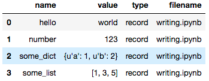
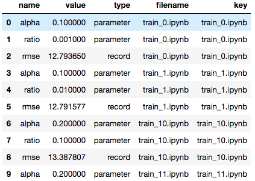

<a href="https://github.com/nteract/papermill"></a>
=======================================================================================================================================================================

[](https://travis-ci.org/nteract/papermill)
[](https://codecov.io/github/nteract/papermill?branch=master)
[](http://papermill.readthedocs.io/en/latest/?badge=latest)
[](https://mybinder.org/v2/gh/nteract/papermill/master?filepath=papermill%2Ftests%2Fnotebooks%2Fbinder.ipynb)
[](https://github.com/ambv/black)

**Papermill** is a tool for parameterizing, executing, and analyzing
Jupyter Notebooks.

Papermill lets you:

-   **parameterize** notebooks
-   **execute** and **collect** metrics across the notebooks
-   **summarize collections** of notebooks

This opens up new opportunities for how notebooks can be used. For
example:

-   Perhaps you have a financial report that you wish to run with
    different values on the first or last day of a month or at the
    beginning or end of the year, **using parameters** makes this task
    easier.
-   Do you want to run a notebook and depending on its results, choose a
    particular notebook to run next? You can now programmatically
    **execute a workflow** without having to copy and paste from
    notebook to notebook manually.
-   Do you have plots and visualizations spread across 10 or more
    notebooks? Now you can choose which plots to programmatically
    display a **summary** **collection** in a notebook to share with
    others.

Installation
------------

From the command line:

``` {.sourceCode .bash}
pip install papermill
```

Installing In-Notebook bindings
-------------------------------

-   [Python](https://github.com/nteract/papermill#python-in-notebook-bindings) (included in this repo)
-   [R](https://github.com/nteract/papermillr) (**experimentally** available in the
    **papermillr** project)

Other language bindings welcome if someone would like to maintain parallel implementations!

Usage
-----

### Parameterizing a Notebook

To parameterize your notebook designate a cell with the tag ``parameters``.

Papermill looks for the ``parameters`` cell and treats this cell as defaults for the parameters passed in at execution time. Papermill will add a new cell tagged with ``injected-parameters`` with input parameters in order to overwrite the values in ``parameters``. If no cell is tagged with ``parameters`` the injected cell will be inserted at the top of the notebook.

Additionally, if you rerun notebooks through papermill and it will reuse the ``injected-parameters`` cell from the prior run. In this case Papermill will replace the old ``injected-parameters`` cell with the new run's inputs.


### Executing a Notebook

The two ways to execute the notebook with parameters are: (1) through
the Python API and (2) through the command line interface.

#### Execute via the Python API

``` {.sourceCode .python}
import papermill as pm

pm.execute_notebook(
   'path/to/input.ipynb',
   'path/to/output.ipynb',
   parameters = dict(alpha=0.6, ratio=0.1)
)
```

#### Execute via CLI

Here's an example of a local notebook being executed and output to an
Amazon S3 account:

``` {.sourceCode .bash}
$ papermill local/input.ipynb s3://bkt/output.ipynb -p alpha 0.6 -p l1_ratio 0.1
```

In the above example, two parameters are set: ``alpha`` and ``l1_ratio`` using ``-p`` (``--parameters`` also works). Parameter values that look like booleans or numbers will be interpreted as such. Here are the different ways users may set parameters:

``` {.sourceCode .bash}
$ papermill local/input.ipynb s3://bkt/output.ipynb -r version 1.0
```

Using ``-r`` or ``--parameters_raw``, users can set parameters one by one. However, unlike ``-p``, the parameter will remain a string, even if it may be interpreted as a number or boolean.

``` {.sourceCode .bash}
$ papermill local/input.ipynb s3://bkt/output.ipynb -f parameters.yaml
```

Using ``-f`` or ``--parameters_file``, users can provide a YAML file from which parameter values should be read.

``` {.sourceCode .bash}
$ papermill local/input.ipynb s3://bkt/output.ipynb -y "
alpha: 0.6
l1_ratio: 0.1"
```

Using ``-y`` or ``--parameters_yaml``, users can directly provide a YAML string containing parameter values.

``` {.sourceCode .bash}
$ papermill local/input.ipynb s3://bkt/output.ipynb -b YWxwaGE6IDAuNgpsMV9yYXRpbzogMC4xCg==
```

Using ``-b`` or ``--parameters_base64``, users can provide a YAML string, base64-encoded, containing parameter values.

When using YAML to pass arguments, through ``-y``, ``-b`` or ``-f``, parameter values can be arrays or dictionaries:

``` {.sourceCode .bash}
$ papermill local/input.ipynb s3://bkt/output.ipynb -y "
x:
    - 0.0
    - 1.0
    - 2.0
    - 3.0
linear_function:
    slope: 3.0
    intercept: 1.0"
```

Python In-notebook Bindings
---------------------------

### Recording Values to the Notebook

Users can save values to the notebook document to be consumed by other
notebooks.

Recording values to be saved with the notebook.

``` {.sourceCode .python}
"""notebook.ipynb"""
import papermill as pm

pm.record("hello", "world")
pm.record("number", 123)
pm.record("some_list", [1, 3, 5])
pm.record("some_dict", {"a": 1, "b": 2})
```

Users can recover those values as a Pandas dataframe via the
`read_notebook` function.

``` {.sourceCode .python}
"""summary.ipynb"""
import papermill as pm

nb = pm.read_notebook('notebook.ipynb')
nb.dataframe
```



### Displaying Plots and Images Saved by Other Notebooks

Display a matplotlib histogram with the key name `matplotlib_hist`.

``` {.sourceCode .python}
"""notebook.ipynb"""
import papermill as pm
from ggplot import mpg
import matplotlib.pyplot as plt

# turn off interactive plotting to avoid double plotting
plt.ioff()

f = plt.figure()
plt.hist('cty', bins=12, data=mpg)
pm.display('matplotlib_hist', f)
```


Read in that above notebook and display the plot saved at
`matplotlib_hist`.

``` {.sourceCode .python}
"""summary.ipynb"""
import papermill as pm

nb = pm.read_notebook('notebook.ipynb')
nb.display_output('matplotlib_hist')
```


### Analyzing a Collection of Notebooks

Papermill can read in a directory of notebooks and provides the
`NotebookCollection` interface for operating on them.

``` {.sourceCode .python}
"""summary.ipynb"""
import papermill as pm

nbs = pm.read_notebooks('/path/to/results/')

# Show named plot from 'notebook1.ipynb'
# Accept a key or list of keys to plot in order.
nbs.display_output('train_1.ipynb', 'matplotlib_hist')
```


``` {.sourceCode .python}
# Dataframe for all notebooks in collection
nbs.dataframe.head(10)
```



Development Guide
-----------------

Read CONTRIBUTING.md for guidelines on how to setup a local development environment and make code changes back to Papermill.

For development guidelines look in the DEVELOPMENT_GUIDE.md file. This should inform you on how to make particular additions to the code base.

Documentation
-------------

We host the [Papermill documentation](http://papermill.readthedocs.io)
on ReadTheDocs.
